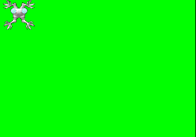

## Tuto 0: simple sprite drawing

## Initializing the PSX
System::init()

First, the system class initializes the PSX hardware.

The last three functions in System::init() do the following:
* sets the location (0,0) and size (256,240) of a
  rectangle structure
* Fills the area in VRAM set in the rectangle with the 
  color given by the r,g,b components (0-255)
* Tells the GPU to start displaying by setting the display
  mask to 1

## Initializing PSX graphics
Describing System::init_graphics()

The PSX has an area of VRAM of size 1024x512 px, split
into 64x256 texture pages. This VRAM is used by the GPU
to both store texture data and draw what will be displayed
on screen. This VRAM is inaccessable to the programmer
and is totally handled by the GPU. 

VRAM IMAGE HERE

All drawing and handling of VRAM is done by sending
commands to the GPU. These commands are first stored in
primitive structures such as POLY_F3, DRAWENV, and 
DISPENV by the programmer, then sent to the gpu via
functions that take these structures as arguments.

Back to init_graphics(): First, FntLoad() and SetDumpFnt()
load a basic font texture (I think from within the bios)
into VRAM at x,y location 960,256. Then SetDmpFnt() tells
the SONY library where and what size in VRAM the font
texture is, so then you can draw text on the screen
via the FntPrint() function.

Next, GPU command primitives are filled in with information
ast to where in VRAM to draw and display
graphics via SetDefDrawEnv() and SetDefDispEnv(). These
commands will be sent to the GPU each frame via 
PutDispEnv() and PutDrawEnv().
There are two calls each of these so we can have double
buffering. While one area is used for drawing, the other
is displayed. These areas are switched every draw cycle.
In this case, the VRAM area at 0,0 with size 320,240 is used
for drawing while 0,240 with size 320,240 is used for
displaying, all for the first display buffer. The second
display buffer swaps these (0,240 for drawing and 0,0 for
displaying).

IMG HERE

draw[0].isbg and draw[1].isb are flags to the GPU to
say to automatically clear the background each draw
cycle. In this case the background color is set to 0,255,0
(green: r,g,b)

Finally, displaying is enabled with SetDispMak(1) (I think
this may be unnuecessary to be called again..?) 

## Sprite texture loading
Sprite::load_texture()

This function takes a bunch of arguments in order to load
both texture data and CLUT (color look up data) into
VRAM. Texture and CLUT data are the raw pixel data of
the image, and the color palette to draw with (for 8
and 4bit textures). PSX also supports 16 bit images
which don't use clut data. 640,0 is the VRAM location
where the texture is loaded - notice this aligns
with 64x256 increments for texture pages. Texture size
is sent as well - this is the total size of the texture;
for sprite sheets or times when you don't want to draw
with the entire texture, this is specified in the sprite
primitive instead. Finally, the CLUT vram position is 
included as well, assuming there is any CLUT data to
use (not drawing a 16bit texture).

## Sprite initialization

Before the texture is uploaded to VRAM via Texture::load()
(described further down), the GPU primitive used to draw the
sprite is initialized via SetPolyFT4(),  setXYWH(), 
setUVWH(), and setRGB0(), all called in the
constructor (Sprite_textured::Sprite_textured()).

SetPolyFT4() initializes the POLY_FT4 structure used
to draw the sprite. The F means the primitive has
a single color (if G is used, e.g. POLY_G4, then gouraud
shading is used and each corner of the primitive can
have its own color), the T means the primitive is textured,
and 4 is the number of vertices the primitive has.

setXYWH() sets the position on screen to draw the sprite
(relative to the current draw env set by PutDrawEnv())
and its size (w,h). The sprite can be stretched to be
larger than its texture and the GPU will auto scale.

setUVWH() sets the texture coordinates offset within
the texture page, and the size to use. E.g. if u,v is 5,5 then the primitive
will be drawn with the texture clipped starting at 5,5
from the top left of the texture. Then if w,h is 64,64,
but the loaded texture size was 256,256, then only the 
texture area from 5,5, to 5+64,5+64 will be used when
drawing.

IMAGE HERE

setRGB0() sets the "color" of the POLY primitive. In
this case, sense the POLY is textured, the color means
the brightness of each R,G,B component used when drawing.
128,128,128 here just means middle brightness.

Now back to actually loading the texture in 
Sprite_textured::load_texture()

## Actually loading the texture
Texture::load()

Taking the same arguments as Sprite_textured::load(),
this function actually calls the PSYQ functions to 
send texture and clut data to VRAM.

LoadClut() takes the clut data (always 16bit color data
of size 256x1 px I believe) and puts it at the VRAM
location specified by the last two arguments. A common
place to load them is 0,481 and lower, right below
the second display buffer (0,240 with size 320,240).
LoadClut() returns an identification number of the clut
based on its VRAM location, which is set within the POLY
primitive so the GPU knows where to get its clut data from.

LoadTPage() is basically the same as LoadClut() except it
requires more arguments. Besides the texture data, the
bits per pixel (bpp) of the texture must be specified
as 4bit, 8bit, or 16bit, which I have set an enum type
for (TEXTURE_BPP in Texture.h). 0 means 4bit, 1 means 8bit
and 2 means 16bit (I think I might have some typos in
the code comments for this, whoops, I should fix that!)
LoadTPage() also returns an ID number to be set within the
POLY primitive, again so the GPU knows where to get its
texture data from.

Back to Sprite_textured::load_texture(), after the 
above have been
called via Texture::load(), the POLY u,v,w,h are set
again via setUVWH(), and more importantly, the .tpage
and .clut structure members are set equal to the
identification numbers returned by LoadClut() and LoadTPage()
as done above.

## Main drawing loop

Looking back at main.cpp, at the for(ever) loop:

* System::start_frame() is called
* Sprite::draw() is called
* System::end_frame() is called

System::start_frame() swaps the display and draw areas
used by the GPU via PutDrawEnv() and PutDispEnv(), using
whichever areas are specified by cur_buf. Then cur_buf
is switched (cur_buf = !cur_buf) while we work on the 
next frame

Sprite_textured::draw() simply calls DrawPrim(),
which takes in a void pointer to any valid primitive
type such as POLY_FT4, which is what the Sprite_textured
class uses. This command tells the GPU to immediately
draw this primitive in the current DRAWENV. Later sample
programs will send multiple drawing commands to the GPU
as a list via an "order table", which will be described
later.

System::end_frame() does two things. First, it makes 
sure all FntPrint() calls have been drawn via the
FntFlush() call. Second, it waits for the GPU drawing frame
to the t.v. to finish via the VSync() call. Technically
this function is missing a DrawSync() call as well, which
will wait for the GPU to finish processing any commands.

Finally, when we run the program we should see the following:

