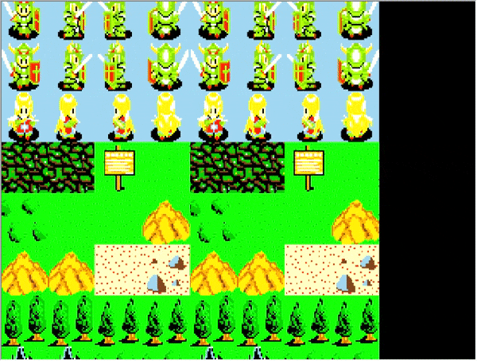

## Tuto 11: Mosaic Effect

Tile blurred effect like you're focusing and unfocusing

## Idea

A set of sprites are drawn in a grid. The texture for each
sprite is blurred by shrinking the u,v,w,h of the texture area used.
Meaning, the texture size gets smaller but is still stretched to 
match the primitive size. Hence, the image gets more blurry.

## main()

We have a single Texture class instance (prim_texture) which
all of the sprites will share. The sprites are an array of
POLY_FT4s (prims). The shared texture size is 256x256 px, which
will be drawn by a 16x16 grid of sprites (NCELL_X,NCELL_Y), where
each sprite will draw its chunk of the total sprite area.

In init_prim(), the POLY_FT4s are initialized per usual. A new addition
is the call to SetShadeTex(), which, with an argument of 1, disables 
shading for the primitive (an argument of 0 enables shading). The psyq
reference describes the following:

"When texture and shading are both ON, each pixel in the polygon is calculated 
as shown below from the pixel value T of the corresponding texture pattern, 
and the brightness value L corresponding to the pixel value T"
...
"When [the second argument] = 1, the brightness value is not divided, and the texture 
pattern value is used, as it is, as the pixel value."

## calculating the U,V area

In the main for(ever) loop, the size and area of the texture used for each sprite
is set via the call to setUV4(). The arguments are pairs of u,v coordinates as
offsets from the top left of the texture page, the order of which is a Z shape
(top left, top right, bottom left, bottom right). The left u coordinates are 
equal to the texture blurring rate (move inwards from the left side of the texture),
while the right u coordinates are the texture area width minus the rate (move inwards
from the right side). The same idea is done for the top and bottom v coordinates.

The primitives are added to the system order table at an arbitrary depth of 1.

The result should look like this:

