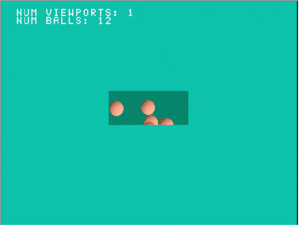

## Tuto 13: More viewports

Similar to TUTO 9, drawing is done in multiple viewports. This time, however,
the viewports are randomly scattered across the screen and draw the same
image.

## Idea

Like sample 9, multiple DRAWENVs are used to set the area used for drawing,
however in this sample each viewport uses the same order table, that way
the same primitives are drawn in each viewport.

The two largest additions to this sample are the Ball and Viewport classes,
both defined entirely within main.cpp

## Ball class

The Ball class contains a Sprite_textured, to draw the ball texture with,
then x,y position and velocity variables so they can be moved around the
screen. Each ball moves randomly around the screen at a different velocity,
and 'bumps' off of the walls of its specified area (the move() function).
The draw() function adds the sprite to the System internal order table, which
is shared among all viewports.

## Viewport class

The Viewport class manages a DRAWENV and its position and size on the screen.
The draw() function takes in the main System class internal DRAWENV for the 
current draw buffer, so that way the Viewport draw env can have the same
starting VRAM y coordinate (0 or 240). The x,y position of the drawenv
will be based off of that. The PSYQ function GetDrawEnv() is used in main to
get the current DRAWENV environment in use.
The draw() function also takes in an OT pointer and its size to draw with,
which is the current display buffer OT from within the System class; again
shared with all Viewports.

## main()

The main drawing loop acts mostly as normal, except System::end_frame() is never
called; instead, each Viewport() instance is drawn in a for loop, with the current
DRAWENV and ot from within System, and then FntFlush(),DrawSync(), and VSync()
are called afterwords instead. Additionally, the original System DRAWENV is restored
after all Viewports are drawn.

The result should look like this:

