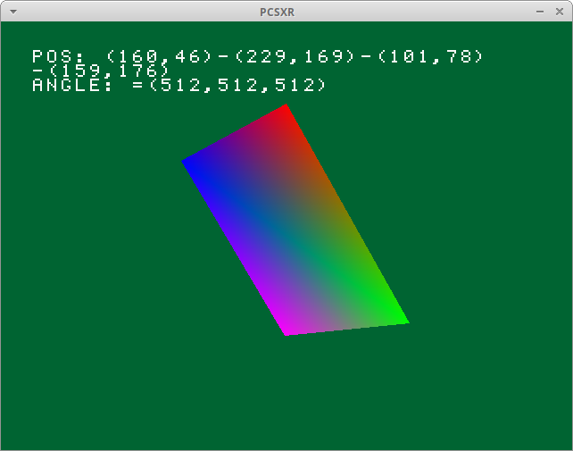

## Tuto 2: Basic 3D Plane

In this sample we start drawing in 3D with a simple plane surface.
It's also gouraud shaded!

## Order Table
An order table is a list of primitives to be drawn by the gpu,
sent as a single command. The order table allows you to 
specify what the depth of the primitive is compared to other
primtives (what will be drawn on top of what), acting like a
"z buffer" although the PSX techinically doesn't have one.

Drawing via an order table is faster than calling DrawPrim()
for each primitive like was done in tuto0. If I remember
right, this is due to the order table being sent to the GPU
via DMA.

The order table is stored simply as an array of unsigned
long integers (u_long). Each entry in the array represents
a level of depth. This depth can be ascending or descending
depending on how you clear and set the OT data.

The data within the array is basically a set of pointers
(a linked list) pointing to each of the primitives to
draw. 

Lameguy64 has a nice and better description of order tables
in his tutorial series, highly recommend checking it out:
[[http://lameguy64.net/?page=tools]] TODO add user,password
for SVN

Primitives are added to the list via AddPrim(), which
takes in a pointer to the OT location in the array
to add the list to, then a void pointer to the primitive
itself. It's important that the primitive data is still
in scope when when the order table is drawn, e.g. the
POLY primitive should not be destroyed before drawing.

## Main program

In main(), we have a 3d array of Sprite_textured(), where
the last 2 dims represent the x and y position of the sprite
(relative to the top left), and the 1st dim represents
the order table depth (equivalent to z depth).

System::init() and System::init_graphics() are called
and work the same as the previous tutorial.

Next, each sprite is initialized. Every call to load_texture()
besides the first one is technically redundant, since you
are just overwriting texture data. However, the clut data
for each Order Table level is different. A more efficient
method would be to have the sprites share the same
texture ID, which is done further down in the x,y for loops. 
Each set of
sprite's clut data is stored one row below the previous
clut data, starting at position 0,481 in VRAM. The sprites
at each level are drawn in a square grid.

In the double nested for loop over x_index and y_index,
Sprite_textured::copy_texture() is called. This internally
calls Texture::copy_from(), which copies the texture ID
and CLUT ID from the given one. This prevents unnecessary
copying of texture and clut data like described above.

## Main loop: start frame

In this sample, System::start_frame() acts slightly
differently from tuto0. The Draw and Disp envs are swapped
like normal, but now we also call ClearOTag().

ClearOTag() clears and initializes the order table
data sent as the first argument. The second argument
is the length of the order table, which is equal to
the u_long ot array size (8 in this case). Alternatively,
you can call ClearOTagR(), which initializes the OT in
reverse (the beginning is at the end of the array), and is
faster, and is used for 3d drawing.

## Main loop: sprite drawing

Sprite_textured::draw_ordered() is used this time
instead of plain old draw(). draw_ordered() accesses
our System class instance to add the sprite's internal
POLY primitive to the system order table for the current
buffer. System::add_prim() calls AddPrim(), as described
above, to the given depth in the OT. If ClearOTagR() was used
above, the resulting order drawn with the given depth
would be reversed. 

draw_ordered(), unlike tuto0, does NOT immediately tell
the GPU to draw its primitive; all primitives are
added to the OT first, and then the OT is sent to the GPU
in a single command.

## Main loop: end frame
Once all the sprites have been added to the OT, its time
to draw the OT.

System::end_frame() calls DrawOTag(), which takes
the OT array for the current buffer as its argument.
If ClearOTagR() was used, you would have to send
DrawOTag a pointer to the LAST entry in the array
(e.g. &ot[OT_LENGTH-1]) as its argument, as the last
array entry is the beginning of the primitive list to 
be drawn. Here however, the beginning of the array is
used.

Additionally, besides FntFlush() and VSync(), DrawSync()
is called as well to let the GPU finish processing its
current commands.

when we run the program we should see the following:

