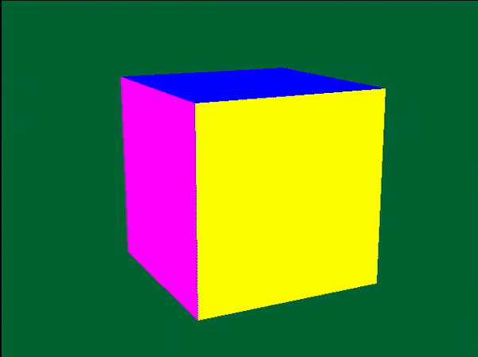

## Tuto 3: Basic 3D Cube

This time we draw 6 different planes to make a cube

## Cube class
The Cube class introduced here contains a static set of coordinates
used by all Cube instances for drawing - static SVECTORs P0-P7,
defining each corner of the cube. static SVECTORs N0-N7, defining
each surface normal, and vertices and normals arrays which make
up the primitive coordinates using P0-P7 and normals coordinates
using N0-N7. Additionally, each Cube instance has its own set of
CVECTORs for each  surface color, and POLY_F4s for the primitives
to store the transformed 3d to 2d coordinates and to be drawn.
Finally, each Cube instance has its own MATRIX, for local coordinates
transformations, and its own angle and translation vectors which are
used to create its MATRIX via RotMatrix() and TransMatrix().

## Cube class: drawing
The Cube::draw() function works mostly the same as the previous 
sample (3d coordinates->2d screen coordinates into primitve->draw
the primitive), with a few changes:

* Before calling SetRotMatrix() and SetTransMatrix(), we call PushMatrix(),
  which saves the GTE's current transformation matrix into a register; its'
  essentially a stack push except the stack has a max size of 1.
* Instead of calling RotTransPers() for each POLY primitive, RotAverageNclip4()
  is called instead. This function automatically calculates the OT depth
  for us to use, stored in otz,
  instead of setting an arbitrary one as done in the previous
  sample. Like RotTransPers, the first four arguments are the input
  coordinates to be transformed, then the next four arguments are the
  outputs to store the results in, which are again our POLY_F4 x,y,z
  coordinates.
* RotAverageNclip4() returns an isomote value, which represents if the
  primitive is back faced if the value is less than zero, which in 
  that case we don't want to draw the plane and hence skip it via 
  'continue.'
* We check if the otz value calculated is within our OT array size before
  trying to add it via system->add_prim(). Our OT size has been upgraded
  from 8 to 4096 (Display_buffer.h) to give us a wider range of possible
  depths.
* After all of the 6 square faces have been added to the order table,
  the previously pushed GTE matrix is restored via PopMatrix()

## Pad class
Looking at the main() function, we see we also have an additional
class called Pad. The Pad class needs to be initialized before
graphics initialization calls. Pad::init() causes the PSX to auto
read the controller state into defined buffers, one for each
controller port, via PadInitDirect() and PadStartCom().

For dual shock controllers, an additional buffer is used
and auto read from in order to turn the vibration motors on and off via
PadSetAct() (act for actuators).

For initialization, we can check what type of controller is connected 
via PadInfoMode(). Additionally, we have to wait until the controller
is ready and initialized, which is checked via PadGetState(). PadGetState()
also tells if the controller is connected or not, which you can tell is used
in games when you get a screen that says "Please reconnected your controller"

Pad::read() doesn't actually read the controller state, it just checks the
status of the controller and updates our local copies of the data, which
are buttons_state and buttons_state_prev. You tell which buttons are currently
pressed via masking the appropriate bits of buttons_state (buttons_state
contains the state of ALL controller buttons), which is done in 
Pad::is_held() and Pad::is_clicked(). Analog stick values, on the other hand,
are natively a value from 0 to 255, where 0 is all the way left/down and 255
is all the way right/up, depending which axis you are checking. I converted
these to return values from -128 to 127 instead, so its easier to differentiate
between left and right or up and down.

Finally, to turn on or off one of the vibration motors, you call set_actuator_val(),
which only sets a value in the array which we specified to be auto read from during
initialization.

Most of the code for the Pad class comes from the PSYQ pad samples in Psyq\psx\sample\pad,
and from Orionsoft's PSYQ library: http://onorisoft.free.fr/retro.htm

It's important to note that this code is buggy; when testing on real hardware, the Pad
class causes the system to freeze occasionally for some reason. 
If you don't need/want to use analog controls, there is a simpler debug pad system 
you can use instead, which is used in MAIN.C in the psyq graphics samples under 
Psyq\psx\sample\graphics\BASIC.

## Main loop
Looking through the for(ever) loop in main, we see System::start_frame() is called
as usual. Instead of ClearOTag, however, ClearOTagR() is called instead, which
is faster for 3d drawing.

Next, the pad class is used to rotate the cube. Cube::rotate() simply
adds the given values to its internal current angle vector, which is then
used in Cube::draw() to create its local MATRIX via RotMatrix().

After rotation, Cube::draw() is called as described above.

Finally, System::end_frame() draws the current display buffer's order
table; this time calling DrawOTag() via a pointer to the END of the
current order table, since we used ClearOTagR earlier.

When we run the program we should see the following:

