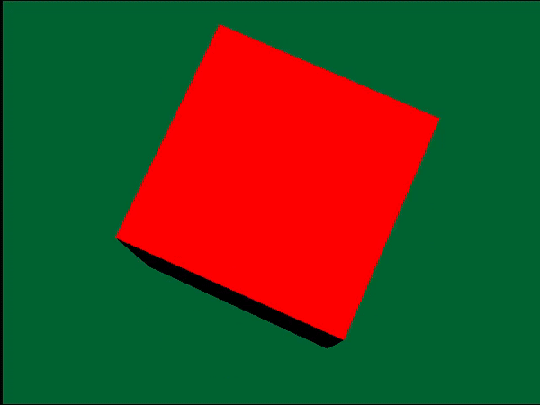

## Tuto 4: Lighting

Cube drawing from previous tutorial except there's lighting

## Modified cube class
Additions to the cube class from sample 3 have been added for
lighting calculation. Although it doesn't make since to have
your lighting info in the cube class (bad practice!), it was
simpler to get the sample to work this way.

## Light variables
The following variables were added for lighting to happen (Cube.h):
* Light tranformation matrix (light_trans_mat) (light coordinates/position)
* Light final matrix (light_mat_final) (combination of position and direction? I think) 
* Light angle vector (light_angle)
* Light color matrix (color_mat) (defines the light color)

These variables are combined in the following steps before drawing the cube
(see Cube::draw()):

* Add the light angle to the light transformation matrix via RotMatrix()
* Apply the current cube's transformation the the light transformation via MulMatrix()
* Apply the above two rotation and transformation to light_mat_final via MulMatrix0().
  Set\* GTE functions need to happen AFTER this function is called, I think due to the
  fact that MulMatrix0 "destroys the constant rotation matrix", according to the PSYQ docs
* Set the light matrices to be used by the GTE via SetColorMatrix() and SetLightMatrix()
  (no calculations are done for color_matrix, it is constant)

The result of the cube drawing is done the same as before, except for one thing:
before the primitive is added to the current system order table, the color of the 
current primitive being drawn is set via NormalColorCol(). This function takes in
a normals vector and the base color to shade as inputs, then stores the darkened
or lighted resulting color in the third argument (our POLY_F4 primitive r0 vector).

Like discussed with angle values, light values are also in terms of 4096 (ONE), which
you can see in Cube.cpp for color_mat and light_mat.

A final important note is that when initializing the colors of each surface (CVECTOR
initialization), the .code member of the struct must be set equal to the primitive
type its being used for (see Cube::Cube(): colors[i].cd = prims[i].code)

