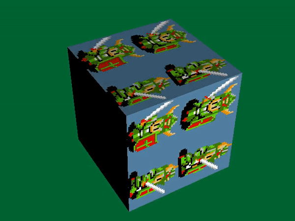

## Tuto 5: Textured cube and lighting

Cube drawing from previous tutorial except the cube is textured now

## Modified Cube class
This version of the Cube class is the same as previous, except
we replaced the POLY_F4 primitives with POLY_FT4 primitives (prims[6]).
(T for textured!).

Thus, additionally a texture is required for the FT4 to use; stored in
the Texture texture class member.

Additionally, this particular texture we only want to use a snippet of,
meaning we have to set u,v coordinates to use within the texture.
These are stored in texture_clip_width and texture_clip_height (from
the top left 0,0 of the texture). The texture data itself comes
from the global_src directory, file BGTEX.C. These values
are updated via Cube::set_texture_size(), which updates each
of the primitives via setUVWH(), setting the clip relative to the top
left of the texture (0,0 is hardcoded).

The colors of the primitives now are all set to 128 for medium brightness
(Cube::Cube()).

The function Cube::load_texture() was added to forward the texture loading
internally to the Texture member.

## Modified main()
The only additions to main() are to first load the cube texture. This
particular texture is 4bit with a total size of 256x256 px, however our
u,v clip we are using is of size 64x64 pixels, which will be stretched to
cover whatever size each of the cube primitives has.

Additionally, notice an extern reference to the texture is added to main
also: 'extern u_long bgtex[]'.

