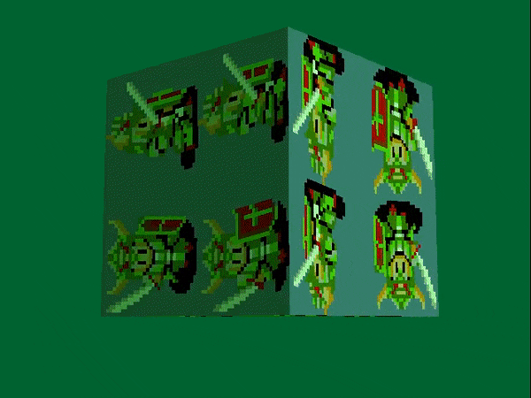

## Tuto 6: Fog lighting/depth queueing

Cube drawing from previous tutorial except fog/depth queue lighting is used

## Additional System initializations

Two additions to the System class have been added:

* We set the color of "fog" via SetFarColor() in System::init_graphics()
* We set the starting point as to where to start applying fog coloring
  via SetFogNear() in System::init_3d(). According to the PSYQ docs, the
  first argument, 'a',
  "defines the Z value at which fog is 0%. A Z value of 5 x a will automatically make fog 100%"

## Cube::draw() modifications

In this sample, NormalColorCol() is replaced with NormalColorDpq(),
which sets the primitive color based on both lighting and the fog
based on the depth of the primitive. This function takes in the resulting
'p' from RotAverageNclip4(), which is defined as the interpolation value
for depth queueing.

Additionally, in main(), the controller now moves the cube forward and
backward via cube.translate() instead of rotation, which is done automatically.

The result should look like this:

