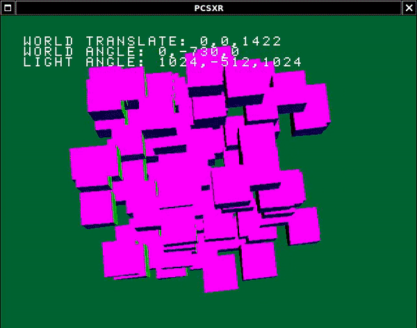

## Tuto 7: Multiple/many cubes sharing world transformation matrix

Untextured, lighted cubes from previous tutorials except there's a
bunch of them and they're all centered around a single world matrix

## Additions to main()
In this sample, there are 100 Cube class instances instead of a single
one. There is now a global world_angle vector, world_translate vector, 
and world_transform MATRIX, all of which are used by each cube instance
to draw themselves relative to the set world coordinates.

Additionally, the light angle vector (lgtang) has been extracted from
the Cube class and is shared by all Cube instances also.

After the System initializations, each cube's local translation is set
to a random point, which will be translated relative to the global
set world_translate point.

After System::start_frame() and pad reads are done as per usual,
we calculate the world transformations via RotMatrix() and TransMatrix().

Next, we initialize the local_transform matrix with world_transform via MulMatrix2(),
so each cube will use world_transform as its starting transformation.

The world rotation and transformations are set for use via SetRotMatrix() and SetTransMatrix(),
so they're used by each cube instance.

## Individual cube drawing
Still in main(), each cube is rotated by the same amount, however could be rotated differently
by changing the values sent to Cube::rotate(). 

In Cube::draw(), which now takes the local_transform matrix and light angle calcuated above,
we first save the current GTE matrix via PushMatrix() like before, however this is more useful
now as we actually have the current matrix to save (world_transform). When we are done drawing
the current cube, PopMatrix() is called which restores the previously set world_transform.

Next, we apply our cube's individual translation via RotTrans(), specifically to local_transform's
.t data member. The cube's individual rotation is applied to local_transform via 
RotMatrix(). This is in contrast to previous samples, where our local translation and rotation
were applied to our internal MATRIX, 'mat'. 

Our input light_angle and local_transform is used to calculate the light
matrices as done previously.

Next, the Set\* functions are called as usual to apply our matrices for use by the GTE. The
rest of the cube drawing is done as normal, noting we changed the primitive color calculation
back to the original light color calculation (NormalColorCol()) instead of fog/depth queueing
from the previous sample.

The result should look like this:

